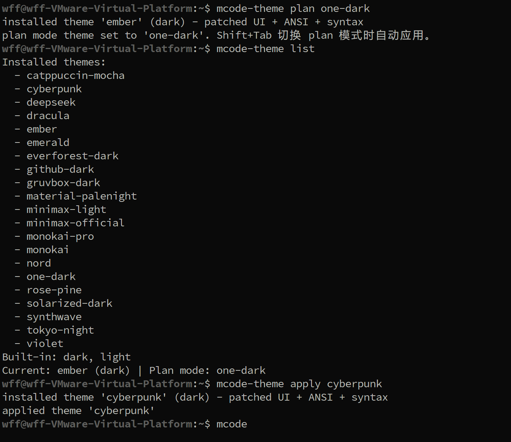
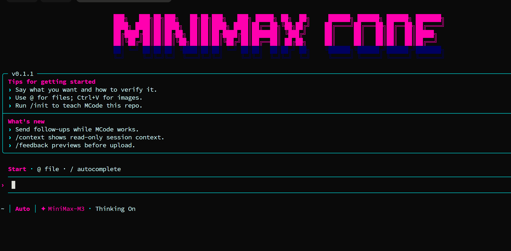
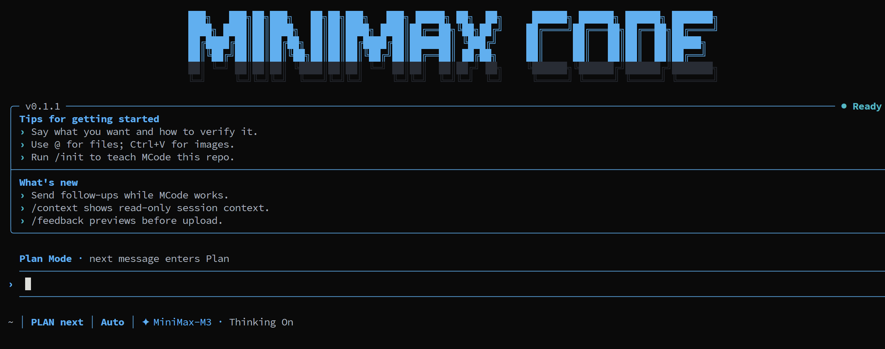
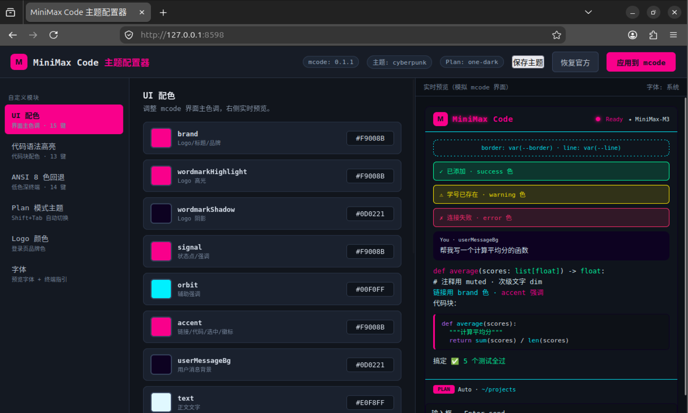

# mcode-theme — MiniMax Code CLI 主题插件

让用户自定义 MiniMax Code CLI 的主题（当前官方版本主题硬编码，无配置入口）。

## 截图

| 命令用法 | 基础模式（ember 主题） |
|---|---|
|  |  |

| Plan 模式（tokyo-night 主题） | Web 调色盘 |
|---|---|
|  |  |

- `0-usage.png` — mcode-theme 命令行用法
- `1-basic-mode.png` — 应用主题后的 mcode 基础模式
- `2-plan-mode.png` — 切换 Plan 模式后自动应用 Plan 主题
- `3-web-palette.png` — Web 可视化调色盘（http://localhost:8598）

## 原理

MiniMax Code CLI 基于 pi-agent 改造（TUI 派生自 Pi TUI）。pi 有完整的主题系统
（`theme-schema.json` + `~/.pi/agent/themes/` + `--theme` 参数），但 mcode 把主题
**硬编码**在 `cli.js` 中：

```js
// cli.js 中唯一的主题定义（两处，dark/light）
id:"minimax",appearance:"dark",colors:Object.freeze({brand:"#68C0FF",...})
```

mcode 的主题渲染通过只读 getter 代理 `me` 读取 `$A`（= dark 或 light 的 colors），
**没有任何外部配置入口**（config.yaml 无 theme 字段、无环境变量、扩展 API 无渲染接口）。

本工具通过**安全补丁**替换 cli.js 中的颜色对象实现主题定制：
- 首次安装自动备份原文件（`cli.js.minimax-original`）
- 只替换对应 appearance（dark/light）的颜色块，另一套不受影响
- 校验颜色值合法性，未知键忽略并警告
- 可随时 `restore` 恢复官方主题

```bash
mcode-theme web                # 启动可视化配置器 → http://localhost:8598
mcode-theme web --port 9000    # 指定端口
```

浏览器打开后：
- **6 大自定义模块**（左侧导航）：UI 配色 / 代码语法高亮 / ANSI 8 色 / Plan 模式主题 / Logo / 字体
- **调色盘**：每个颜色键有取色器 + HEX 输入，改动**实时预览**
- **实时预览**：右侧模拟完整 mcode 界面（Logo/边框/状态栏/对话气泡/代码块/Plan 徽标/输入框）
- **应用到 mcode**：一键写回 cli.js（Ctrl+S 快捷键）
- **保存主题**：把当前配色存为新主题，出现在列表里
- 字体模块：调整预览字体 + 各终端字体设置指引

## 安装

```bash
# 放到 PATH（例如 ~/bin 或 /usr/local/bin）
cp mcode-theme ~/bin/mcode-theme
chmod +x ~/bin/mcode-theme
```

## 用法

```bash
mcode-theme create my-theme      # 生成主题模板（基于官方 dark 主题）
mcode-theme install my-theme.json  # 安装并应用主题
mcode-theme apply synthwave      # 应用已安装的主题（~/.minimax/themes/ 下）
mcode-theme list                 # 列出已安装主题
mcode-theme current              # 显示当前主题
mcode-theme plan                 # 交互式选择 Plan 模式主题
mcode-theme plan <name>          # 指定 Plan 模式主题
mcode-theme unplan               # 清除 Plan 模式主题
mcode-theme random               # 随机应用一个已安装主题
```
mcode-theme restore              # 恢复官方默认主题
```

安装后重启 mcode 生效。

## Plan 模式主题（Shift+Tab 自动切换）

mcode 的 **Shift+Tab** 快捷键切换 Plan 模式（`/plan`）。本工具支持为 Plan 模式
设置**独立主题**：正常模式下用 A 主题，按 Shift+Tab 进入 Plan 模式自动切到 B 主题，
退出 Plan 模式自动切回 A。

```bash
mcode-theme apply tokyo-night    # 正常模式主题（东京夜蓝）
mcode-theme plan synthwave       # Plan 模式主题（赛博霓虹）
mcode-theme plan                 # 或者交互式从列表选择
mcode-theme list                 # 显示: Current: tokyo-night | Plan mode: synthwave
mcode-theme unplan               # 取消 Plan 主题（Plan 模式与正常模式同主题）
```

原理：工具在 cli.js 顶层注入 `__mcodePlanThemeActive` / `__mcodePlanTheme` /
`__mcodeCurrentTheme` 变量，并 patch 三处钩子：
- **主题应用函数**（qsn / 旧版 gai）：Plan 激活时把待应用主题替换为 Plan 主题
- **chrome 构造函数**（Bdn）：每次状态变化在**渲染前**检测 Plan 模式并刷新主题色，
  保证界面整体切换（而非只换状态栏）
- **状态栏渲染函数**（pon / 旧版 Jai）：Plan 模式徽标显示

Plan 模式激活时自动切换主题，退出自动切回。

注意：
- `apply` 切换正常主题后，Plan 主题自动保留
- `restore` 恢复官方会清除所有配置（包括 Plan 主题）
- 语法高亮（Sri）不随 Plan 切换（只有 UI 配色切换）
- 工具自动记录 mcode 版本指纹；mcode 升级覆盖 cli.js 后会提示重新 apply
- 每次 patch 后自动做 JS 语法校验，若破坏自动回滚官方版

## 主题 JSON 格式

```json
{
  "name": "synthwave",
  "appearance": "dark",
  "colors": {
    "brand": "#FF6B6B",
    "accent": "#FF6B6B",
    "text": "#F8F0FF",
    "userMessageBg": "#2A1E3F",
    "muted": "#B8A8D8",
    "dim": "#8A7BA8",
    "border": "#4A3A6A",
    "line": "#8A7BA8",
    "success": "#4ADE80",
    "warning": "#FFC340",
    "error": "#FF5E6C",
    "signal": "#FF6B6B",
    "orbit": "#FFD93D",
    "wordmarkHighlight": "#FF8E8E",
    "wordmarkShadow": "#E05555"
  }
}
```

### 颜色键说明（15 个，均可选，缺省用官方值）

| 键 | 用途 |
|----|------|
| brand | 品牌色（logo/标题） |
| accent | 强调色（链接/代码/选中） |
| signal | 状态/强调信号色 |
| orbit | 辅助强调色 |
| wordmarkHighlight / wordmarkShadow | logo 高光/阴影 |
| text / muted / dim | 文本三级层次 |
| border / line | 边框/分隔线 |
| userMessageBg | 用户消息背景 |
| success / warning / error | 成功/警告/错误 |
| 布局背景 | 由终端背景决定（dark/light 二选一） |

## 与 pi-agent 主题的差异

| 项 | pi-agent | mcode + 本工具 |
|----|----------|----------------|
| 主题文件 | `~/.pi/agent/themes/<name>.json` | `~/.minimax/themes/<name>.json` |
| 结构 | vars（变量）+ colors（语义映射） | colors（15 键扁平，同 mcode 官方结构） |
| 加载 | 运行时发现 + `--theme` 参数 | 启动前补丁替换（需重启） |
| 终端适配 | auto/dark/light 自动 | 终端探测决定 dark/light，二选一替换 |

## 注意事项

- 每次 `mcode update` 升级后 cli.js 会被覆盖，需要重新 `mcode-theme apply <name>`
- 工具基于官方 cli.js 的 `id:"minimax",appearance:"dark|light",colors:Object.freeze({...})`
  模式匹配，若未来版本结构变化会报 "cannot find official theme block"，提示版本不匹配
- 补丁仅修改颜色值，不影响其他功能；备份文件保证可回滚

## 更新日志

### v1.0.0（2026-08-15）

**修复**
- **Plan 主题切换不生效**：旧实现只在状态栏渲染函数里更新颜色对象（KA），
  但 mcode 渲染无持续循环，导致已渲染区域保持旧色。新增 `Bdn`（chrome 构造）
  钩子——每次状态变化在**渲染前**刷新主题色，Plan 切换时界面整体生效。
- **Plan 主题二次 patch 生成非法 JS**：贪婪正则吞掉 `__mcodeCurrentTheme`，
  改为整条 `var __mcodePlanThemeActive=...;` 语句替换。
- **patch 失败回滚丢失已应用主题**：失败时回滚到官方原版而非 patch 前状态，
  改为回滚到 patch 前内容（新增 `read_cli()`）。

**适配**
- 兼容 mcode 0.1.1：主题应用函数由 `gai` 重命名为 `qsn`、状态栏渲染函数由
  `Jai` 重命名为 `pon`（按模式匹配，自动适配）。

**新增**
- 21 个内置主题（catppuccin / github-dark / claude-code / codex / kimi /
  minimax 官方等）
- Web 可视化调色盘（http://localhost:8598）：6 大模块实时预览 + Ctrl+S 写回
- Plan 模式主题联动（Shift+Tab 自动切换）
